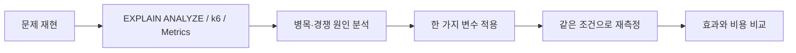

# Public Service Performance Lab

공공시설 조회와 제한 정원 예약을 소재로, **병목과 race condition을 먼저 재현하고 실행계획·부하 지표를 근거로 개선한** Spring Boot 백엔드 프로젝트입니다.

기능 수를 늘리는 대신 두 질문에 집중했습니다.

- Facility 100만 건에서 `Pageable` 검색의 Page SELECT와 COUNT는 어디에서 느려지는가?
- 한 Program에 예약이 몰릴 때 일반 transaction만으로 정원과 예약 행의 정합성을 지킬 수 있는가?

## 핵심 성과

| 실험 | Before | After | 관찰한 변화 |
|---|---:|---:|---|
| Facility B: `region=GWANGJU`, Page 검사 행 | 960,020 | **20** | `(region)` 인덱스로 첫 페이지 탐색 범위 축소 |
| Facility B: 40 VU p95 | 3,741.50ms | **132.77ms** | 약 3.742초 → 0.133초 |
| Facility B: 40 VU RPS | 12.11 | **140.89** | 같은 closed-loop workload에서 약 11.64배 |
| Redis hot read A p95 | 62.14ms | **14.01ms** | warm cache hit에서 77.45% 감소 |
| Redis hot read B p95 | 44.56ms | **5.26ms** | warm cache hit에서 88.19% 감소 |
| Redis hit 구간 DB 실행 | Page + COUNT 반복 | **Page 0회, COUNT 0회** | 동일 페이지의 DB round trip과 반복 집계 제거 |
| 예약: capacity 100 / 200 동시 요청 | count 불일치, 5xx 159~164 | **201=100, 409=100, 5xx=0** | Pessimistic Lock 적용 후 deadlock 0, count=rows=100 |

위 수치는 로컬 Windows 환경의 비교 실험 결과입니다. Facility 부하는 0.2초 think time이 있는 k6 closed-loop 방식이므로 최대 처리량 벤치마크가 아닙니다. 캐시 수치는 사전 적재된 warm hit 구간이며, 예약 수치는 **단일 인기 Program에 200명이 동시에 한 번씩 요청한 고경합 조건**입니다.



## 기술 스택

| 영역 | 기술 |
|---|---|
| Application | Java 21, Spring Boot 4.1.1, Gradle 9.7.1 |
| API / Persistence | Spring Web MVC, Spring Data JPA, Specification, Hibernate |
| Database | MySQL 8.4.11, HikariCP |
| Cache | Spring Cache, Redis 7.4 |
| Load test | Grafana k6 2.1.0 |
| Monitoring | Actuator, Micrometer, Prometheus 3.14.0, Grafana 13.2.1 |
| Test | JUnit 5, MockMvc, 실제 Docker MySQL/Redis 통합 테스트 |

## 아키텍처

Spring Boot는 Windows host에서 실행하고 MySQL, Redis, Prometheus, Grafana는 Docker Compose로 실행합니다.

```mermaid
flowchart LR
    K6[k6 one-off container]

    subgraph Host[Windows host]
        APP[Spring Boot :8080]
        ACT[/actuator/prometheus]
    end

    subgraph Docker[Docker Compose]
        MYSQL[(MySQL 8.4)]
        REDIS[(Redis 7.4)]
        PROM[Prometheus :9090]
        GRAF[Grafana :3000]
    end

    K6 -->|HTTP| APP
    APP -->|JPA / JDBC| MYSQL
    APP -->|Facility cache| REDIS
    APP --> ACT
    PROM -->|15s scrape| ACT
    GRAF -->|PromQL| PROM
```

Facility 조회는 `Controller → Service → Specification/Pageable → Repository → MySQL`로 흐릅니다. 반복 검색은 Service 앞의 Redis cache에서 응답 페이지 전체를 재사용합니다. Reservation은 같은 Service transaction 안에서 Program row를 `PESSIMISTIC_WRITE`로 읽고 정원 확인, count 증가, Reservation 저장까지 수행합니다.

## Facility 100만 건 검색 성능 문제

JDBC batch로 생성한 합성 데이터는 무작위가 아닌 결정적 규칙을 사용합니다. 같은 코드와 Enum 순서로 다시 만들면 PK를 제외한 분포가 같습니다.

| region | 행 수 |
|---|---:|
| SEOUL | 300,000 |
| GYEONGGI | 300,000 |
| BUSAN | 150,000 |
| INCHEON | 80,000 |
| DAEGU | 80,000 |
| DAEJEON | 50,000 |
| GWANGJU | 40,000 |

각 region은 district 10개, FacilityType 6개, OperatingStatus 3개가 결정적으로 섞입니다. 100만 건 seed는 batch size 1,000으로 **17.056초**에 완료됐습니다. 이 시간은 생성기 검증값이며 API 성능 수치가 아닙니다. 자세한 생성 규칙과 보호 장치는 [Facility seeding](docs/facility-seeding.md)에 있습니다.

검색 API는 선택적으로 `region`, `district`, `type`을 받고 기본 `page=0`, `size=20`, `id ASC`로 조회합니다.

```http
GET /api/facilities?region=SEOUL&type=LIBRARY&page=0&size=20
```

Specification은 전달된 조건만 `AND`로 조합합니다. 그러나 `Page` 응답은 content 20건을 가져오는 SELECT 외에도 `totalElements`를 위한 COUNT를 실행합니다. 인덱스가 없던 Before에서 조건부 COUNT는 매번 100만 행을 검사했습니다.

| 조건 | 일치 건수 | Page 검사 행 | COUNT 검사 행 | 40 VU p95 |
|---|---:|---:|---:|---:|
| A: SEOUL + LIBRARY | 50,000 | 80 | 1,000,000 | 1,271.96ms |
| B: GWANGJU | 40,000 | **960,020** | 1,000,000 | **3,741.50ms** |
| C: SEOUL + district 1 + LIBRARY | 5,000 | 1,151 | 1,000,000 | 1,928.68ms |

B의 960,020행 검사는 보편적인 `region` 검색 비용을 뜻하지 않습니다. seed가 region별 데이터를 정해진 순서로 연속 삽입했고 GWANGJU가 PK 뒤쪽에 배치됐기 때문에, `ORDER BY id LIMIT 20`이 첫 일치 행을 찾기까지 PK를 길게 순회한 통제 사례입니다. 이 상관관계를 유지한 채 Before/After를 비교했습니다.

- [DB 실행계획 Before](docs/facility-db-baseline.md)
- [HTTP 부하 Before](docs/facility-http-baseline.md)
- [Before 결과 JSON](loadtest/results/facility-before-summary.json)

## EXPLAIN ANALYZE와 인덱스 최적화

InnoDB secondary index에 PRIMARY KEY `id`가 내부적으로 포함되는 점, equality 조건, leftmost prefix와 `ORDER BY id`를 함께 고려해 세 인덱스를 하나씩 실험했습니다.

```sql
CREATE INDEX idx_facility_region
    ON facility (region);
CREATE INDEX idx_facility_region_type
    ON facility (region, type);
CREATE INDEX idx_facility_region_district_type
    ON facility (region, district, type);
```

| 조건 | 실제 선택 index | Page 검사 Before → After | COUNT 검사 Before → After | 40 VU p95 Before → After | RPS Before → After |
|---|---|---:|---:|---:|---:|
| A | `idx_facility_region_type` | 80 → **20** | 1,000,000 → **50,000** | 1,271.96 → **259.59ms** | 30.29 → **121.18** |
| B | `idx_facility_region` | 960,020 → **20** | 1,000,000 → **40,000** | 3,741.50 → **132.77ms** | 12.11 → **140.89** |
| C | `idx_facility_region_district_type` | 1,151 → **20** | 1,000,000 → **5,000** | 1,928.68 → **19.28ms** | 24.47 → **161.84** |

최종 계획은 Page에서 `Limit → Index lookup`, COUNT에서 covering index lookup을 사용했고 여섯 쿼리 모두 full scan과 filesort가 사라졌습니다. COUNT는 O(1)이 된 것이 아니라 일치하는 50,000/40,000/5,000개 index entry를 여전히 읽습니다. 인덱스는 읽기를 줄이는 대신 저장공간과 INSERT/UPDATE 비용을 추가하므로 실제 검색 패턴을 기준으로 유지해야 합니다.

- [인덱스 실험과 실행계획](docs/facility-index-optimization.md)
- [재현 SQL](sql/facility-search-indexes.sql)
- [Index After 결과 JSON](loadtest/results/facility-index-after-summary.json)

## Redis 반복 조회 캐시 최적화

인덱스 적용 뒤에도 동일 URL을 반복하면 매 요청마다 Page SELECT와 COUNT가 실행됐습니다. A baseline에서는 COUNT 약 15,708회가 약 7.858억 index entry를, B에서는 약 16,214회가 약 6.488억 entry를 검사했습니다. 각 workload DB statement 시간의 약 92~94%가 COUNT였습니다.

검색 조건, page, size, paged 여부와 모든 sort를 포함한 key로 `FacilityPageResponse` 전체를 5분간 캐시했습니다. miss는 기존 DB 흐름을 그대로 실행하고, hit는 Page와 COUNT를 모두 건너뜁니다.

| 40 VU hot read | Cache Before | Redis warm hit | 변화 |
|---|---:|---:|---:|
| A p95 | 62.14ms | **14.01ms** | -77.45% |
| A RPS | 148.24 | **167.47** | +12.98% |
| B p95 | 44.56ms | **5.26ms** | -88.19% |
| B RPS | 155.96 | **169.25** | +8.52% |
| A/B Page SELECT·COUNT | 요청마다 반복 | **각 0회** | warm hit 구간 DB 작업 제거 |

RPS 증폭이 latency 감소보다 작은 이유는 각 VU가 요청 후 0.2초 기다리기 때문입니다. Redis는 모든 조회에 무조건 필요한 선택이 아닙니다. 이 프로젝트에서는 **동일 인기 페이지가 반복되는 hot-read workload**에서 수억 건의 반복 index entry 검사와 DB round trip을 제거하는 효과가 확인됐기 때문에 유지했습니다.

현재 write API가 없어 TTL만 사용합니다. Facility 변경 기능이 생기면 invalidation이 필요하고, cold miss stampede, key cardinality, 직렬화 크기와 Redis 장애 시 DB 복귀 비용도 관리해야 합니다. cache read/write 장애는 fail-open으로 처리해 DB 결과를 반환하지만 timeout만큼 tail latency가 늘 수 있습니다.

- [Cache Before](docs/facility-cache-baseline.md) · [결과 JSON](loadtest/results/facility-cache-before-summary.json)
- [Redis After](docs/facility-cache-optimization.md) · [결과 JSON](loadtest/results/facility-cache-after-summary.json)

## Reservation 동시성 문제 재현

예약 로직은 Program 조회 → 정원 확인 → `reservedCount + 1` → Reservation 저장입니다. No Lock에서는 일반 `@Transactional`만 사용했습니다.

capacity 100인 Program에 서로 다른 participant 200명이 동시에 요청했을 때 실제 MySQL에서 lost update와 1213 deadlock을 반복 재현했습니다.

| No Lock HTTP run | 201 | 409 | 5xx / MySQL 1213 | reservedCount | Reservation rows |
|---:|---:|---:|---:|---:|---:|
| 1 | 39 | 0 | 161 | 19 | 39 |
| 2 | 41 | 0 | 159 | 20 | 41 |
| 3 | 36 | 0 | 164 | 18 | 36 |

Reservation 행은 commit됐지만 여러 transaction이 읽은 같은 count를 뒤늦게 덮어써 `reservedCount == Reservation rows` 불변식이 깨졌습니다. Reservation FK 검사에서 얻은 parent S lock과 Program UPDATE의 X lock 경쟁도 대량 deadlock으로 이어졌습니다.

- [Service 동시성 Before](docs/reservation-concurrency-baseline.md)
- [HTTP 동시성 Before](docs/reservation-http-concurrency-baseline.md)
- [No Lock 결과 JSON](loadtest/results/reservation-http-concurrency-before-summary.json)

## 네 가지 예약 전략 비교

모든 전략은 capacity 100, 서로 다른 participant 200명, Hikari max 10 조건으로 비교했습니다.

| 지표 | No Lock | Pessimistic | Optimistic | Optimistic + Retry |
|---|---:|---:|---:|---:|
| count와 Reservation rows | **불일치** | 일치 | 일치 | 일치 |
| 201 / run | 36~41 | **100** | 21~25 | 88~100 |
| 409 / run | 0 | **100** | 0 | 0~17 |
| 최종 5xx / run | 159~164 | **0** | 175~179 | 83~112 |
| MySQL 1213 / run | 159~164 | **0** | 147~159 | 256~309 |
| optimistic conflict / run | 0 | 0 | 20~28 | 94~100 |
| transaction attempts / run | 200 | 200 | 200 | 473~494 |
| 정상 201 평균 RPS | 24.39 | **58.53** | 13.26 | 39.20 |
| 평균 p95 | 1.223초 | 1.454초 | 1.372초 | 2.244초 |
| Hikari pending max | 73~172 | 135~170 | 61~141 | 146~166 |

Optimistic의 낮은 p95는 성공 처리 비용이 낮다는 의미가 아닙니다. 요청 대부분이 rollback과 500으로 일찍 종료됐습니다. 최대 3 attempts와 jitter를 적용한 Retry는 성공률을 높였지만 DB transaction을 요청 수의 약 2.4배로 늘리고도 최종 5xx를 제거하지 못했습니다.

- [Pessimistic 실험](docs/reservation-pessimistic-lock.md) · [결과](loadtest/results/reservation-pessimistic-lock-summary.json)
- [Optimistic 실험](docs/reservation-optimistic-lock.md) · [결과](loadtest/results/reservation-optimistic-lock-summary.json)
- [Optimistic + Retry](docs/reservation-optimistic-retry.md) · [결과](loadtest/results/reservation-optimistic-retry-summary.json)
- [최종 비교와 선택](docs/reservation-concurrency-comparison.md)

## Pessimistic Lock 최종 선택

현재 main 코드는 Program을 다음 방식으로 조회합니다.

```java
@Lock(LockModeType.PESSIMISTIC_WRITE)
@Query("select p from Program p where p.id = :id")
Optional<Program> findByIdForUpdate(@Param("id") Long id);
```

동일한 `@Transactional` 안에서 lock 획득, 최신 capacity 확인, count 증가, Reservation 저장과 commit을 수행합니다. 기존 3회 실험 모두 **201=100, 409=100, 5xx=0, 1213=0, reservedCount=rows=100**이었습니다. 정상 201 처리량도 네 전략 중 가장 높은 평균 58.53 RPS였습니다.

대가는 같은 Program row의 직렬화입니다. Pessimistic 실험에서 매 run 약 199회의 row-lock wait가 발생했고 Hikari active는 10, pending은 135~170까지 관찰됐습니다. 따라서 Pessimistic이 항상 Optimistic보다 우월하다는 결론이 아닙니다. 요청이 여러 Program으로 분산되거나 충돌이 드문 workload에서는 Optimistic 전략이 유리할 수 있습니다. 선택 범위는 **한 인기 Program에 요청이 집중되는 이번 고경합 조건**입니다.

## 모니터링과 부하테스트

Prometheus는 15초마다 `/actuator/prometheus`를 수집하고 Grafana dashboard는 다음 10개 패널을 자동 provisioning합니다.

- HTTP RPS, p95 `histogram_quantile`, 4xx/5xx 비율
- JVM heap, process/system CPU, JVM threads
- Hikari active, idle, pending, max

k6 스크립트는 endpoint별 smoke와 warm-up 뒤 같은 VU 단계·think time으로 Before/After를 측정합니다. DB는 `EXPLAIN`과 `EXPLAIN ANALYZE`, Performance Schema statement/rows counter를 함께 사용해 HTTP 지연과 실제 검사 범위를 연결했습니다. 짧은 부하의 Hikari/CPU peak는 15초 scrape가 놓칠 수 있어 직접 Actuator 표본도 보조로 기록했습니다.

- [모니터링 구성과 dashboard](docs/monitoring.md)
- [Facility k6](loadtest/facility-baseline.js) · [Cache k6](loadtest/facility-cache-baseline.js) · [Reservation k6](loadtest/reservation-concurrency-baseline.js)

## 테스트와 검증

최종 상태에서 `ddl-auto=validate`로 전체 build를 실행했고 **30개 테스트가 모두 통과**했습니다.

- Facility 조건 조합·Pageable·응답 형태를 실제 MySQL과 검증
- deterministic seed 분포와 일반 실행에서 seed 미동작 검증
- Redis key 분리, miss/hit, TTL과 Repository 호출 생략 검증
- Reservation 단일 성공, 정원 초과 409, participant 중복 409, 없는 Program 404 검증
- Service 동시성 테스트를 3회 반복해 매번 100 성공, 100 정상 거절, 예외 0, count=rows=100 검증
- 최종 HTTP 200 VU 확인에서도 201=100, 409=100, 5xx=0, 1213=0 검증
- Facility 1,000,000건과 고유 이름, 데이터 checksum, 검색 인덱스 유지 확인

통합 테스트 fixture는 테스트가 직접 생성·정리하며 운영 reset endpoint는 없습니다.

## 주요 기술적 의사결정

| 결정 | 이유 | 감수한 비용 |
|---|---|---|
| `Specification` 동적 조건 | 전달된 조건만 SQL WHERE에 포함해 실행계획을 해석 가능하게 유지 | 검색 조건이 늘면 조합과 테스트 증가 |
| `Pageable` | 100만 Entity 전체 적재 방지, totalElements 제공 | 매 요청 COUNT 비용 발생 |
| 세 복합/단일 인덱스 | equality + implicit PK 순서로 각 실제 검색과 `ORDER BY id` 대응 | 저장공간과 쓰기 비용 증가 |
| Page 전체 Redis cache, TTL 5분 | hot read의 Page SELECT와 COUNT를 함께 제거 | stale data, invalidation, 메모리, cold stampede 고려 필요 |
| Redis fail-open | cache 장애 시 기존 DB 조회로 API 가용성 유지 | 장애 시 DB 부하 복귀와 timeout 비용 |
| Program Pessimistic Lock | 단일 row 고경합에서 정합성·정상 거절·성공 처리량 확보 | row 직렬화, lock/connection 대기 |
| 실험 SQL과 결과 JSON version control | 코드 외 DB 상태와 수치를 재현·검토 가능하게 보존 | 적용 순서와 환경 통제가 필요 |

## 한계와 향후 개선

- 측정값은 한 로컬 Windows PC에서 얻었으며 MySQL container CPU를 별도 exporter로 분리하지 않았습니다.
- Facility 부하는 closed-loop라 응답이 빨라질수록 요청 수가 늘어납니다. 고정 arrival rate와 장시간 soak test가 추가로 필요합니다.
- deterministic seed는 재현성을 높이지만 실제 지역·PK 분포를 대표하지 않습니다. 랜덤화·시간 순서·skew가 다른 데이터셋과 비교할 수 있습니다.
- `Page` COUNT가 필요 없는 화면에는 `Slice`, keyset pagination 또는 별도 count 정책을 실험할 수 있습니다.
- Redis cold miss stampede, eviction/maxmemory, serialization 변경과 Facility write 시 cache invalidation을 검증해야 합니다.
- 예약은 취소·대기열·결제·회원 기능이 없는 최소 모델입니다. 여러 Program에 부하가 분산된 조건과 lock timeout, 장애 복구를 추가로 측정할 수 있습니다.
- Pessimistic Lock의 transaction은 짧게 유지해야 하며 외부 API 호출을 lock 범위에 넣지 않아야 합니다.

## 실행 방법

필수 환경은 Java 21과 Docker Desktop입니다. 저장소의 DB 계정과 Grafana 계정은 로컬 실험 전용이며 외부 운영 환경에서 재사용하지 않습니다.

```powershell
# MySQL, Redis, Prometheus, Grafana 시작
docker compose up -d
docker compose ps

# build 및 테스트
.\gradlew.bat build

# Spring Boot 실행
.\gradlew.bat bootRun
```

기본 접속 주소:

| 대상 | 주소 |
|---|---|
| API / Actuator | `http://localhost:8080` |
| Health | `http://localhost:8080/actuator/health` |
| Prometheus metrics | `http://localhost:8080/actuator/prometheus` |
| Prometheus | `http://localhost:9090` |
| Grafana | `http://localhost:3000` |

Facility 데이터가 비어 있는 로컬 실험 DB에서만 seed profile을 명시적으로 실행합니다. 일반 앱 실행에서는 seed가 동작하지 않습니다.

```powershell
.\gradlew.bat build
java -jar build/libs/public-service-0.0.1-SNAPSHOT.jar `
  --spring.profiles.active=seed `
  --seed.facility.count=1000000
```

검색 인덱스는 Entity annotation이나 앱 시작 시 자동 생성하지 않습니다. DB와 데이터 건수를 확인한 뒤 [실험 SQL](sql/facility-search-indexes.sql)을 한 번만 적용합니다. 이미 인덱스가 있는 DB에는 재실행하지 않습니다.

주요 API:

```http
GET /api/facilities/{id}
GET /api/facilities?region=SEOUL&district=SEOUL-DISTRICT-1&type=LIBRARY&page=0&size=20
POST /api/programs/{programId}/reservations
Content-Type: application/json

{"participantId":"participant-1"}
```

Program 생성/reset용 운영 API는 제공하지 않습니다. 예약 동시성 실험과 API 검증은 테스트 fixture를 사용합니다. Docker와 dashboard 사용법, k6 재실행 조건과 위험한 데이터 초기화 절차는 각 상세 문서를 따라야 합니다.

```powershell
# 컨테이너 종료. named volume은 유지됩니다.
docker compose down
```

`docker compose down -v`는 Facility 데이터가 들어 있는 volume까지 제거하므로 데이터 보존이 필요할 때 사용하지 않습니다.
