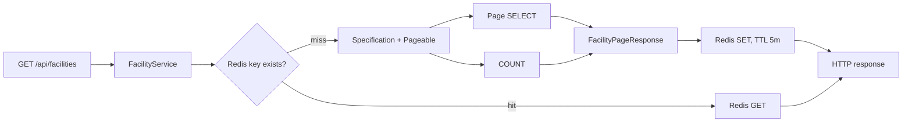

# Facility Redis Cache Optimization

## 목적과 실험 통제

Facility 검색 인덱스를 적용한 뒤에도 동일한 인기 검색이 반복되면 요청마다 Page SELECT와
`totalElements`용 COUNT가 실행됐다. 이 실험은 검색 결과 페이지 전체를 Redis에 캐시하여 cache hit에서
두 SQL을 모두 생략하는지, 그리고 HTTP·DB·Hikari 비용이 실제로 줄어드는지 검증한다.

Before와 After는 같은 Facility 1,000,000건, 검색 인덱스 세 개, API, Repository/Specification,
Pageable, Hikari max=10, MySQL 컨테이너, Prometheus 15초 scrape, k6 스크립트 및
5/10/20/40 VU 단계를 사용했다. After의 유일한 서비스 성능 변수는 Redis 캐시다.

- A: `region=SEOUL&type=LIBRARY&page=0&size=20`, 50,000건 일치
- B: `region=GWANGJU&page=0&size=20`, 40,000건 일치
- k6: `grafana/k6:2.1.0`, `host.docker.internal:8080`
- Redis: `redis:7.4-alpine`, host 포트 `127.0.0.1:16379`
- 측정 스크립트: [facility-cache-baseline.js](../loadtest/facility-cache-baseline.js)
- 스크립트 SHA-256: `6E3CC412C9AFC7442AD29FB001F9358712AF733F96F91BA41929FB96A290385D`

기존 스크립트는 수정하지 않았다. 각 endpoint는 1 VU 10초 smoke, 1→3 VU 30초 warm-up 후
5→10→20→40 VU를 각각 10초 상승, 40초 유지, 5초 하강으로 실행한다. VU마다 요청 후 0.2초를
기다리는 closed-loop workload다. 단계 RPS는 기존 Before와 같이 각 단계의 55초 전체를 분모로 계산했다.

After timed baseline 직전에는 Redis DB를 비우고 대상 URL을 한 번 호출해 캐시를 채운 다음 Redis 통계를
초기화했다. 따라서 아래 성능값은 재현 가능한 **warm cache hit** 비용이다. 최초 miss 비용은 별도로
검증했다. TTL 5분은 220초 baseline 전체가 만료 없이 유지되면서도 로컬 실험의 stale 데이터와 메모리
점유를 제한하도록 정했다.

## 구현

`FacilityService.getFacilities(...)`에 Spring Cache의 `@Cacheable`을 적용했다. Spring Boot가 구성하는
`RedisCacheManager`를 사용하므로 별도 Redis 접근 코드를 서비스에 넣지 않고 기존 조회 흐름을 유지한다.
Page 응답 DTO는 Redis 기본 JDK value serializer로 저장할 수 있도록 `Serializable`을 구현한다.

### 캐시 키

키 형식은 다음과 같다.

```text
facilitySearch::v1|region=<value>|district=<value>|type=<value>
  |paged=<boolean>|page=<number>|size=<number>
  |sort=<property>:<direction>:<null-handling>:<ignore-case>
```

검색 문자열과 sort property는 URL-safe Base64로 인코딩하고 null은 `~`로 표현한다. 구분자가 포함된
사용자 값과 구조상 충돌하지 않는다. region, district, type, page, size, paged 여부와 모든 sort order가
키에 들어가므로 결과에 영향을 주는 입력이 다르면 별도 entry가 된다. `v1`은 향후 응답 또는 키 규칙이
바뀔 때 기존 entry와 분리할 수 있게 한다.

실제 확인한 키는 다음과 같이 서로 달랐다.

```text
facilitySearch::v1|region=U0VPVUw|district=~|type=TElCUkFSWQ|paged=true|page=0|size=20|sort=aWQ:ASC:NATIVE:false
facilitySearch::v1|region=R1dBTkdKVQ|district=~|type=~|paged=true|page=0|size=20|sort=aWQ:ASC:NATIVE:false
```

### miss와 hit 흐름



빈 Redis에서 A를 호출했을 때 Page SELECT 1회/20행과 COUNT 1회/50,000행이 발생했고, B는
Page 1회/20행과 COUNT 1회/40,000행이 발생했다. 각 응답이 Redis에 저장된 후 동일 요청에서는 두 SQL의
Performance Schema digest가 모두 증가하지 않았다. A와 B를 번갈아 호출해도 두 entry를 사용했고
Repository 호출은 최초 miss 두 번뿐이었다.

Redis 연결 오류는 `CacheErrorHandler`가 읽기/쓰기 오류를 처리한다. read 실패 시 기존 서비스 메서드가
DB를 조회하고, write 실패 시 DB 결과를 그대로 반환한다. 1초 connect/command timeout과 30초 간격의
경고 로그 제한을 두었다. Redis 컨테이너를 중지한 실제 확인에서도 API는 HTTP 200과 정상 결과를
반환했다. 이 방식은 가용성을 지키지만 장애 중 트래픽이 DB로 돌아가며 timeout만큼 지연될 수 있다.

캐시 통계는 Redis local statistics를 활성화하여 Actuator에서 다음 meter로 확인할 수 있다.

```text
cache_gets_total{cache="facilitySearch",result="hit|miss|pending"}
cache_puts_total{cache="facilitySearch"}
lettuce_seconds_count{db_system="redis",db_operation="GET|SET|..."}
```

## 테스트 검증

추가 테스트는 다음을 검증한다.

- 같은 조건은 같은 key, 조건·page·size·sort 차이는 다른 key가 된다.
- 첫 요청 후 실제 Redis key와 1~300초 TTL이 존재한다.
- 같은 요청을 두 번 호출해도 Repository `findAll`은 한 번만 실행된다.
- A와 B는 두 entry로 분리되며 각 두 번째 요청은 캐시에서 반환된다.

기존 Controller 통합 테스트는 트랜잭션 내부 fixture가 외부 Redis에 남지 않도록 해당 테스트 context에서만
cache type을 `none`으로 사용한다. 캐시 통합 테스트는 실제 Docker MySQL과 Redis를 사용한다.

## k6 결과

Smoke와 warm-up, baseline의 HTTP/응답 내용 check는 모두 100% 통과했고 HTTP error rate는 0%였다.

### After 단계별

| 대상 | VU | requests | RPS | avg ms | p95 ms | p99 ms |
|---|---:|---:|---:|---:|---:|---:|
| A | 5 | 1,138 | 20.69 | 5.89 | 10.10 | 25.63 |
| A | 10 | 2,286 | 41.56 | 6.22 | 15.77 | 40.62 |
| A | 20 | 4,612 | 83.85 | 4.98 | 10.48 | 25.78 |
| A | 40 | 9,211 | **167.47** | **5.59** | **14.01** | **49.80** |
| B | 5 | 1,146 | 20.84 | 4.68 | 6.29 | 12.16 |
| B | 10 | 2,312 | 42.04 | 3.89 | 4.89 | 5.76 |
| B | 20 | 4,637 | 84.31 | 4.05 | 5.32 | 8.47 |
| B | 40 | 9,309 | **169.25** | **3.49** | **5.26** | **7.43** |

### Before와 After, 40 VU

| 대상 | 지표 | Before | After | 변화 |
|---|---|---:|---:|---:|
| A | RPS | 148.24 | 167.47 | **+12.98%** |
| A | avg | 31.83ms | 5.59ms | **-82.44%** |
| A | p95 | 62.14ms | 14.01ms | **-77.45%** |
| A | p99 | 103.64ms | 49.80ms | **-51.95%** |
| B | RPS | 155.96 | 169.25 | **+8.52%** |
| B | avg | 20.59ms | 3.49ms | **-83.03%** |
| B | p95 | 44.56ms | 5.26ms | **-88.19%** |
| B | p99 | 72.62ms | 7.43ms | **-89.78%** |

RPS 증가는 latency 감소보다 작다. 각 VU가 매 iteration마다 0.2초를 기다리는 closed-loop 설계이므로
캐시 응답이 충분히 빨라진 뒤에는 think time이 처리율의 상한을 만든다. 따라서 이 결과를 서버 최대 RPS로
해석할 수 없다.

## DB workload 제거

Performance Schema의 동일 SQL digest를 baseline 직전과 직후에 비교했다.

| 대상 | SQL | Before statements | After statements | Before examined rows | After examined rows | 감소 |
|---|---|---:|---:|---:|---:|---:|
| A | Page SELECT | 약 15,677 | **0** | 약 314,000 | **0** | 100% |
| A | COUNT | 약 15,708 | **0** | 약 785,800,000 | **0** | 100% |
| B | Page SELECT | 약 16,174 | **0** | 약 324,180 | **0** | 100% |
| B | COUNT | 약 16,214 | **0** | 약 648,760,000 | **0** | 100% |

Before 카운터는 동시 요청 중 비트랜잭션 Performance Schema snapshot으로 얻어 HTTP 요청 수와 수십 건
차이가 있는 근사값이다. After는 같은 방식에서 전후 snapshot이 완전히 같았다. A timed baseline은 Redis
17,248 hit/0 miss, B는 17,405 hit/0 miss였고 각 Redis DB에는 대상 entry 하나만 있었다. 즉 warm hit에서
Page와 COUNT를 모두 생략했으며, 특히 기존 DB statement 시간의 92~94%를 차지한 COUNT 부하를 제거했다.

## 서버 지표

아래 값은 40 VU 시간 창의 Prometheus 15초 표본 세 개다. HTTP p95는 30초 rate window이며 Grafana
dashboard와 같은 5분 p95도 함께 기록했다. system CPU는 Windows host 전체라 IDE와 Docker 등 다른
프로세스 영향을 포함한다.

| 대상 | 지표 | Before | After |
|---|---|---:|---:|
| A | HTTP server p95 평균 | 46.14ms | **6.00ms** |
| A | Grafana 5m p95 평균 | 34.82ms | **6.33ms** |
| A | process CPU 평균 | 3.76% | **2.79%** |
| A | system CPU 평균 | 77.60% | **58.93%** |
| A | heap 범위 | 48.90–78.54MB | 51.99–58.81MB |
| A | Hikari active 평균/최대 | 4/7 | **0/0** |
| A | Hikari idle 평균/최소 | 6/3 | **10/10** |
| A | Hikari pending 평균/최대 | 0/0 | **0/0** |
| B | HTTP server p95 평균 | 22.61ms | **2.40ms** |
| B | Grafana 5m p95 평균 | 22.32ms | **3.44ms** |
| B | process CPU 평균 | 3.42% | **2.30%** |
| B | system CPU 평균 | 61.84% | **43.69%** |
| B | heap 범위 | 57.62–91.15MB | 51.56–89.79MB |
| B | Hikari active 평균/최대 | 4/7 | **0/0** |
| B | Hikari idle 평균/최소 | 6/3 | **10/10** |
| B | Hikari pending 평균/최대 | 0/0 | **0/0** |

Hikari pending은 Before에도 0이어서 개선 폭을 만들 지표는 아니었다. 반면 active가 4/최대 7에서
계측 표본 전체 0으로 바뀌고 idle이 항상 10이 된 것은 warm hit가 DB connection을 빌리지 않았다는
Performance Schema 결과와 일치한다. Heap은 GC 시점의 영향이 커서 캐시 효과의 단독 근거로 사용하지
않는다. Redis entry 하나의 `MEMORY USAGE`는 A 약 4,264 bytes, B 약 4,248 bytes였다.

## 판단과 trade-off

이 workload에서는 Redis를 유지할 근거가 충분하다. 동일 페이지가 반복되면 수억 건의 COUNT index entry
검사와 수만 회의 DB round trip을 없애고, p95 및 CPU와 Hikari 사용을 함께 줄였다. 특히 인기 검색이
집중될 때 DB가 다른 요청에 쓸 connection과 CPU를 보존한다.

다음 비용도 함께 관리해야 한다.

- **stale data와 invalidation:** 현재 Facility write API가 없어 TTL만 적용했다. 생성·수정·삭제 기능이
  추가되면 관련 검색 key를 evict하거나 version을 바꾸는 정책이 필요하다.
- **메모리:** 조건/page/size/sort 조합마다 entry가 생긴다. 5분 TTL은 체류 시간을 제한하지만 cardinality가
  높으면 Redis 메모리가 늘어난다. 운영 환경에서는 maxmemory와 eviction 정책, 실제 key 수를 측정해야 한다.
- **cold miss와 stampede:** `@Cacheable(sync=true)`를 사용하지 않아 만료 직후 동시 요청은 같은 DB 조회를
  중복할 수 있다. 이번 실험은 warm hit 효과를 격리했으며 cold-cache 동시성은 별도 실험 대상이다.
- **직렬화:** 기본 JDK 직렬화는 구현이 단순하지만 payload와 배포 버전 호환 비용이 있다. DTO 변경 시
  key version 변경 또는 명시적인 JSON serializer를 검토할 수 있다.
- **Redis 장애:** fail-open은 API 가용성을 지키지만 모든 요청이 DB로 복귀한다. 장애 시 DB 용량과 Redis
  timeout의 tail latency를 별도로 관찰해야 한다.

## 결과와 재현 자료

- Cache Before: [facility-cache-before-summary.json](../loadtest/results/facility-cache-before-summary.json)
- Cache After: [facility-cache-after-summary.json](../loadtest/results/facility-cache-after-summary.json)
- k6 스크립트: [facility-cache-baseline.js](../loadtest/facility-cache-baseline.js)
- raw k6/Prometheus/Performance Schema snapshot은 기존 `.gitignore`의 `build/` 아래에 두며 commit하지 않는다.

실행 시 `TARGET=A|B`, `MODE=smoke|warmup|baseline`만 선택한다. After baseline 비교 시에는 TTL 안에
모든 단계가 끝나도록 바로 직전 대상 URL을 한 번 prewarm하고 Redis stats를 초기화해야 한다.

## 최종 상태 검증

- `JAVA_TOOL_OPTIONS=-Dspring.jpa.hibernate.ddl-auto=validate`를 테스트 프로세스에 적용하고
  `.\gradlew.bat build --rerun-tasks`를 실행했다. build는 성공했고 전체 23개 테스트가 실패·오류·skip
  없이 통과했다(기존 18개 + key 단위 테스트 3개 + 실제 Redis 통합 테스트 2개).
- Facility 1,000,000건, distinct name 1,000,000, 지역별 300,000/300,000/150,000/80,000/
  80,000/50,000/40,000건과 region별 district 10개를 확인했다.
- 전체 생성 컬럼을 사용한 기존 CRC32 합계 `2148598155341640`이 유지됐다. 이 값은 변경 감지용이며
  암호학적 무결성 증명은 아니다.
- `SHOW INDEX`에는 `PRIMARY(id)`, `idx_facility_region(region)`,
  `idx_facility_region_type(region,type)`,
  `idx_facility_region_district_type(region,district,type)`만 존재한다.
- MySQL, Redis, Prometheus, Grafana가 실행 중이고 Redis health는 PONG, Spring Boot health와
  Prometheus public-service target은 UP이다.
- Repository, Specification, Hikari 설정, Entity mapping, 검색 API와 기존 k6 workload는 수정하지 않았다.

## 참고 자료

- [Spring Boot cache abstraction and Redis configuration](https://docs.spring.io/spring-boot/reference/io/caching.html)
- [Spring Framework cache annotations](https://docs.spring.io/spring-framework/reference/integration/cache/annotations.html)
- [Spring Data Redis cache statistics and TTL](https://docs.spring.io/spring-data/redis/reference/redis/redis-cache.html)
